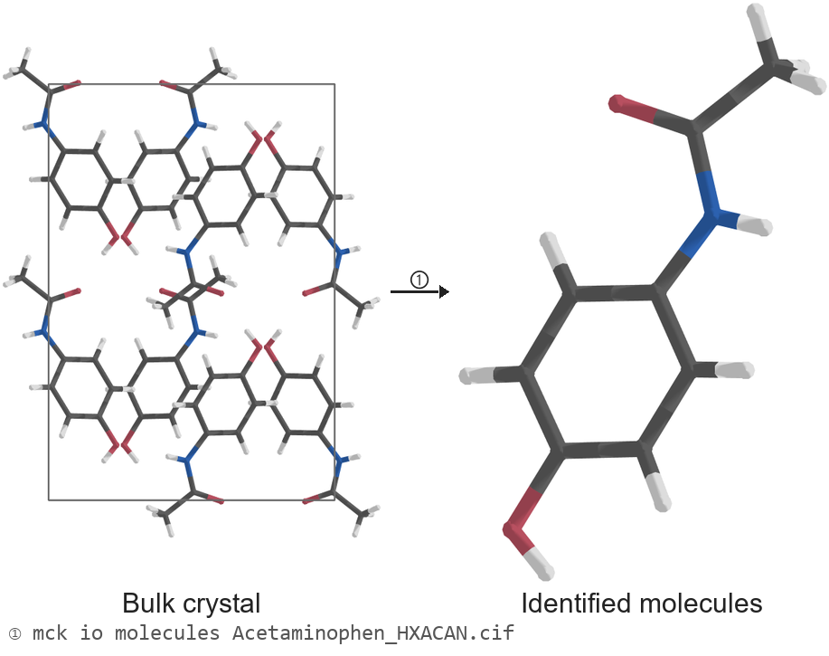
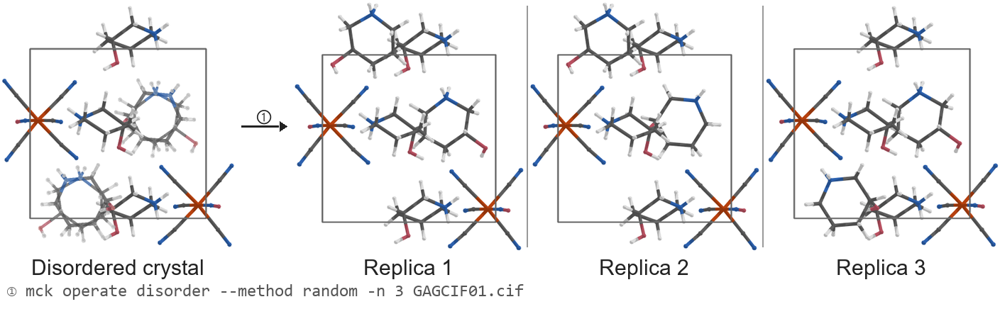
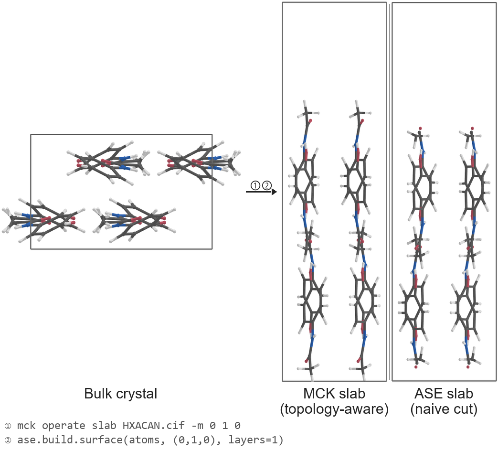
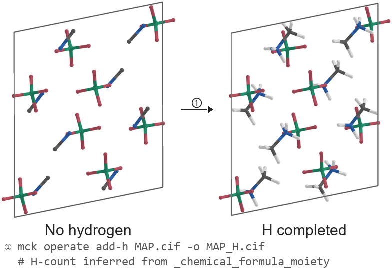
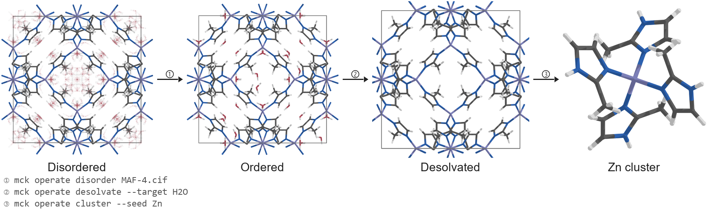

# MolCrysKit: Molecular Crystal Toolkit

[](https://opensource.org/licenses/MIT)
[](#)
[](https://pypi.org/project/molcrys-kit/)
[](https://github.com/SchrodingersCattt/MolCrysKit/actions/workflows/unit-tests.yml)

## Overview

MolCrysKit is a Python toolkit designed for handling molecular crystals, providing utilities for parsing crystallographic data, identifying molecules within crystals, and performing various analyses on molecular crystals using graph theory and the Atomic Simulation Environment (ASE).

## Key Features

- Robust Molecule Identification: Identify individual molecules within a crystal structure using graph-based algorithms
- Disorder Handling: Process disordered structures with graph algorithms
- Topological Surface Generation: Create surface slabs while preserving molecular topology
- Hydrogen Completion: Add hydrogen atoms with heuristic geometric placement rules
- Cluster Carving: Disorder resolution → desolvation → coordination-shell cluster extraction
- LLM-based AI agent Friendliness: Try on https://matmaster.bohrium.com/matmaster or build your own skill for your agent

<p align="center">
  <br>
  <em>Molecule Identification</em>
</p>

<p align="center">
  <br>
  <em>Disorder Handling</em>
</p>

<p align="center">
  <br>
  <em>Topological Surface Generation</em>
</p>

<p align="center">
  <br>
  <em>Hydrogen Completion</em>
</p>

<p align="center">
  <br>
  <em>Cluster Carving</em>
</p>

## Installation

### From PyPI (recommended)

```bash
pip install molcrys-kit
```

### From source (development)

```bash
git clone https://github.com/SchrodingersCattt/MolCrysKit.git
cd MolCrysKit
pip install -e ".[dev]"
```

All dependencies are declared in `pyproject.toml` (there is no separate
`requirements.txt`). `requires-python = ">=3.10"`. The available extras are:

| Extra | Adds |
|---|---|
| `[test]` | `pytest`, `pytest-cov` |
| `[vis]` | `nglview`, `py3Dmol` for 3-D visualisation in notebooks |
| `[dev]` | `[test]` + `[vis]` + `build`, `ruff>=0.15`, `pre-commit`, `nbstripout`, `twine` |

So a contributor environment is `pip install -e ".[dev]"` and a CI / minimal
test environment is `pip install -e ".[test]"`.

## Quick Start

Here's a simple example of how to use MolCrysKit:

```python
import molcrys_kit as mck
from ase import Atoms

# 1. Create a toy system (e.g., 2 Water molecules in a unit cell)
# In practice, you would typically load this from a file: atoms = read('cif_file.cif')
atoms = Atoms(
    symbols=['O', 'H', 'H', 'O', 'H', 'H'],
    positions=[
        [1.0, 1.0, 1.0], [1.8, 1.0, 1.0], [0.7, 1.6, 1.0],  # Molecule 1
        [5.0, 5.0, 5.0], [5.8, 5.0, 5.0], [4.7, 5.6, 5.0]   # Molecule 2
    ],
    cell=[10.0, 10.0, 10.0],
    pbc=True
)

# 2. Initialize MolecularCrystal (Automatically identifies molecules via graph logic)
crystal = mck.MolecularCrystal.from_ase(atoms)

# 3. Access Crystal & Molecular Properties
print(f"Lattice Parameters: {crystal.get_lattice_parameters()}")
print(f"Identified Molecules: {len(crystal.molecules)}") 

mol = crystal.molecules[0]
print(f"Molecule 1 Formula: {mol.get_chemical_formula()}")
print(f"Molecule 1 Center of Mass: {mol.get_center_of_mass()}")
```

## Citation

If you use MolCrysKit in academic work, please cite:

> Guo, M.-Y.; Zhang, W.-X. MolCrysKit: A Topology-Aware Toolkit for Bridging Experimental Molecular-Crystal Structures and Simulation-Ready Modeling. *J. Chem. Inf. Model.* **2026**, *66* (9), 4999-5007. https://doi.org/10.1021/acs.jcim.6c00168

For exact reproduction of the published JCIM results, use the archived
`v0.1.0` release together with the versioned container image and the material
under `paper/`. The `main` branch may continue to evolve after publication.


## Docker / Cloud

See [Docker Guide](docs/docker.md) for local Docker, Bohrium cloud deployment, and GHCR image publication.

## Command Line Interface

Installing MolCrysKit also installs the `mck` command. The CLI is self-documenting;
use `--help` at any level to see the exact arguments for your installed version:

```bash
mck --help
mck io --help
mck operate --help
mck analyze --help
mck operate cluster --help
```

The command groups roughly mirror the Python package layout:

- `mck io ...` — summarize, inspect molecules, extract molecules, and convert structures (`info`, `molecules`, `extract-molecule`, `convert`).
- `mck operate ...` — generate modified structures (`disorder`, `add-h`, `slab`, `cluster`, `supercell`, `vacancy`, `desolvate`, `interpolate`).
- `mck analyze ...` — print analysis reports (`bfdh`, `interactions`, `polyhedra`).

## Documentation

| You are… | Start here |
|---|---|
| **Using the library** | [API & Capabilities](docs/api.md) · [Tutorials](docs/tutorials.md) |
| **AI agent (using the library)** | [API & Capabilities](docs/api.md) — read "Capability Map" then "Module Index" |
| **AI agent (modifying code)** | [AGENTS.md](AGENTS.md) · [Architecture](docs/architecture.md) |
| **Docker / cloud** | [Docker Guide](docs/docker.md) |

[`molcrys_kit/`](molcrys_kit/) — source code · [`scripts/`](scripts/) — diagnostic utilities · [`examples/`](examples/) — CIF structure files

## License

This project is licensed under the MIT License - see the [LICENSE](LICENSE) file for details.
